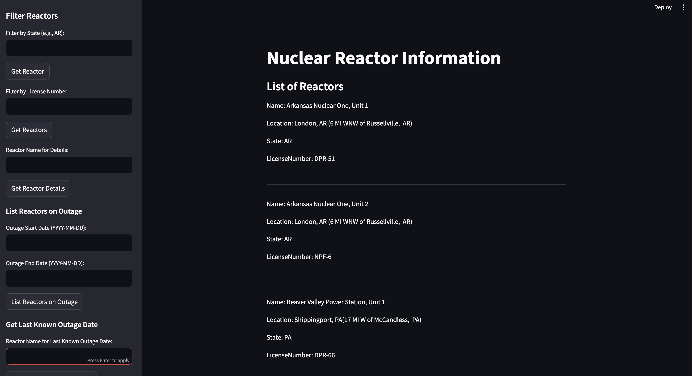
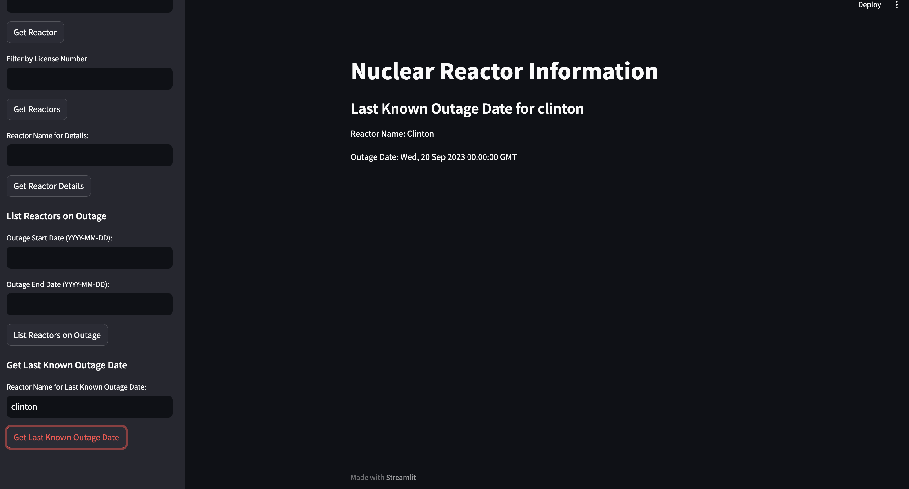
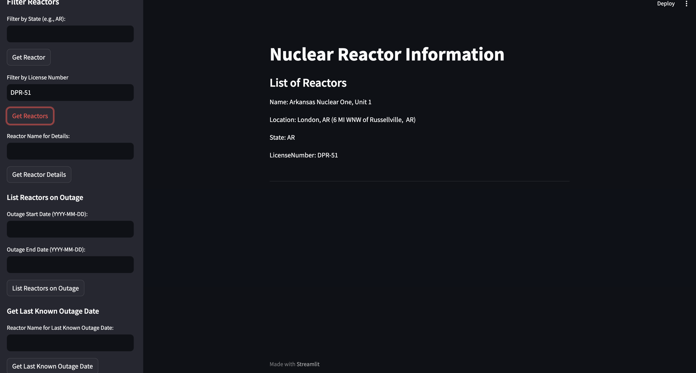

# Nuclear Reactor Information System

The Nuclear Reactor Information System is a web application built with Flask that provides information about nuclear reactors, their status, and related details. It retrieves and stores data in a ClickHouse database and offers a user-friendly interface for querying and filtering reactor information.

## DEMO

[Demo Link](https://drive.google.com/file/d/1dem_JO6BGc0cHscYI-Y7MJJI0NvasL4s/view?usp=sharing)


## ALL Reactors 


## Last Known Outage Of Reactor


## Reactor by License Number



## Table of Contents

- [Installation](#installation)
- [Usage](#usage)
- [Features](#features)

## Installation

To run the Nuclear Reactor Information System on your local machine, follow these steps:

1. **Clone the Repository:**

   ```bash
   git clone https://github.com/yourusername/nuclear-reactor-info.git
   cd sesco
   
2. **Set Up a Python Virtual Environment:**
     ```bash
     #For mac or linux
     python3 -m venv venv
     source venv/bin/activate

     #For windows
     virtualenv venv
     venv\Scripts\activate

3. **Install Dependencies:**
    ```bash
    pip3 install -r requirements.txt

4. **Configuration:**
   Create a .env file in the project root directory and add the following environment variables:
   ```bash
    CLICKHOUSE_HOST=your_clickhouse_host
    CLICKHOUSE_DATABASE=nrc_reactors_details
    BASE_URL=http://127.0.0.1:5000
    DATA_FILE_URL=your_data_url
    DATA_FILE_PATH=path_to_excel_file.xlsx

   My .env
   # ClickHouse Configuration
   CLICKHOUSE_HOST= "localhost"
   CLICKHOUSE_DATABASE= "nrc_reactors_details"

   BASE_URL = "http://127.0.0.1:5000" 
   # File path
   DATA_FILE_PATH=data-files/reactors-operating.xlsx

   # File reactor status path
   DATA_FILE_URL = "https://www.nrc.gov/reading-rm/doc-collections/event-status/reactor-status/powerreactorstatusforlast365days.txt"

5. **Database Setup:**
   Ensure you have ClickHouse installed and configured with the necessary database.
   ```bash
   #Download the binary
   curl https://clickhouse.com/ | sh
   
   # Start the server
   ./clickhouse server

   #Start the client
   ./clickhouse client

   RUN In Client
   ```bash
      CREATE DATABASE IF NOT EXISTS nrc_reactors_details;

6. **Upload Data Script:**
   RUN
   ```bash
   #Wait for Reactor table created! message
   python3 scripts/create_reactors.py

   #Wait for Data processing and insertion completed successfully. message
   #Please ignore any warnings you see
   python3 scripts/create_reactor_status.py

7. **Run the Application:**
   ```bash
   #If you want to access via Postman: 
   python3 app.py
   
   #If you want to access via the front end:
   #Run them in 2 different terminals
   #Please ignore any warnings you see 
   streamlit run streamlit-app.py
   python3 app.py

The application will be available at http://127.0.0.1:5000.

8. **Usage:**
- Access the web application at http://127.0.0.1:5000.
- Use the web interface to filter and query nuclear reactor information.
- Explore reactor details, outage status, and more.

9. **Features:**
- Retrieve reactor details by name, license number, and state.
- Filter reactors on outage by date range.
- Get the last known outage date for a reactor.
- User-friendly web interface.
- Data stored in a ClickHouse database for efficient querying.

10. **Postman Collection:**
It consists Get API collection. Import [postman-collection.txt](postman-collection.txt) directly to postman to view the collection with saved examples and tests. 

11. **Unit Tests:**

This repository contains a set of unit tests for the Reactor API. These tests are designed to ensure the correctness and reliability of the API endpoints by checking various functionalities, including filtering reactors by state, retrieving reactor details, and more.

To run these tests, use a testing framework like unittest. Make sure you have the necessary dependencies installed, and then execute the tests to verify the API's behavior.
```bash
   python3 -m unittest test_routes


